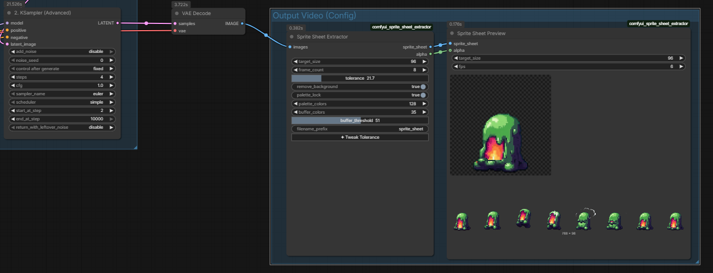
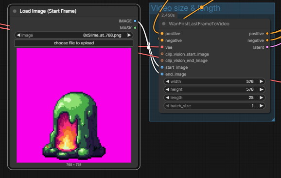

# Sprite Sheet Extractor

Two nodes for extracting square-frame sprite sheets from WAN (or any batch) video output. These nodes were made to enable a workflow of using WAN 2.2 to generate a few frames of low resolution video (at least 25 in my tests), extract n frames evenly spaced out (always including the start frame), perform background removal and pixel-art snapping, then recombine them into a horizontal sprite sheet at the specified resolution (square).

**SpriteSheetExtractor** samples evenly-spaced frames from an IMAGE batch, removes the generated background via per-frame YCbCr chroma keying with flood-fill, and saves a horizontal RGBA sprite sheet PNG. An interactive **Tweak Tolerance** panel lets you adjust the chroma-key threshold after generation without re-running the pipeline.

**SpriteSheetPreview** displays the resulting sprite sheet as a looping pixel-art animation directly inside the node.

## Features

- Per-frame background detection and removal using YCbCr chroma keying with border-seeded flood fill — handles WAN temporal drift, shadows, and gradients
- Fringe softening and spill suppression for clean anti-aliased edges
- **Palette lock** — snap frames 1..n to frame 0's colour palette to fix temporal colour drift while preserving transient effects (fireballs, hit flashes, etc.)
- **Pixel snap** — K-Means quantise + gradient-grid detection collapses each frame to clean pixel-art blocks; output is always resized back to `target_size` so the subject-to-frame ratio is preserved
- Interactive tolerance adjustment via a floating UI panel — no need to re-generate
- Even temporal sampling — generate more frames than needed and pick N evenly-spaced ones
- Auto-incrementing filenames — never silently overwrites a previous run
- Animated preview node with checkerboard background for transparent areas

## Nodes

### SpriteSheetExtractor

| Input | Type | Default | Description |
|---|---|---|---|
| `images` | `IMAGE` | — | Batch of frames from a sampler (B, H, W, C) |
| `target_size` | `INT` | 96 | Output sprite size in pixels (square). 96 = 8× downscale from 768 px WAN output |
| `frame_count` | `INT` | 6 | Number of frames to sample evenly from the input batch |
| `tolerance` | `FLOAT` | 15.0 | YCbCr chroma-key tolerance (0–100). Adjustable after run via the Tweak panel |
| `remove_background` | `BOOLEAN` | True | Auto-detect and remove background per frame |
| `palette_lock` | `BOOLEAN` | False | Snap frames to frame 0's palette to fix colour drift |
| `palette_colors` | `INT` | 32 | Colours extracted from frame 0 (2–256) |
| `buffer_colors` | `INT` | 8 | Extra palette slots for transient colours |
| `buffer_threshold` | `FLOAT` | 30.0 | RGB distance above which a colour is treated as transient |
| `filename_prefix` | `STRING` | `sprite_sheet` | Output filename prefix |
| `pixel_snap` | `BOOLEAN` | False | Enable pixel-art grid snapping on each frame |
| `snap_pixel_size` | `FLOAT` | 0.0 | Cell size in source pixels. `0.0` = auto-detect from gradient peaks; `1.0`+ = explicit override. For WAN 768 px output with `target_size=96`, use `8` (768÷8=96). Non-integer values are supported. |
| `snap_colors` | `INT` | 16 | K-Means palette size used during snapping (2–64). Fewer = more aggressive simplification; more = finer detail preserved before snapping |

| Output | Type | Description |
|---|---|---|
| `sprite_sheet` | `IMAGE` | Horizontal RGBA sprite sheet (RGB channels) |
| `alpha` | `MASK` | Alpha channel of the sprite sheet |

### SpriteSheetPreview

| Input | Type | Default | Description |
|---|---|---|---|
| `sprite_sheet` | `IMAGE` | — | Connect the IMAGE output from SpriteSheetExtractor |
| `target_size` | `INT` | 96 | Must match the extractor's `target_size` |
| `fps` | `INT` | 6 | Animation playback speed |
| `alpha` | `MASK` | — | (optional) Connect the alpha output for checkerboard preview |

## Installation

### Via ComfyUI-Manager

Search for **Sprite Sheet Extractor** in the Manager's "Install Custom Nodes" dialog.

### Manual

```bash
cd ComfyUI/custom_nodes
git clone https://github.com/YOUR_USERNAME/comfyui-sprite-sheet-extractor
```

Restart ComfyUI.

### Dependencies

None beyond ComfyUI's built-in requirements (PyTorch, numpy, Pillow).

## Screenshots




## Usage

1. Generate a batch of frames with WAN (or any video model)
2. Connect the `IMAGE` output to **SpriteSheetExtractor**
3. Set `frame_count` to the number of sprite frames you want
4. Run the workflow
5. Click **✦ Tweak Tolerance** on the node to open the interactive adjustment panel
6. (Optional) Connect the `sprite_sheet` and `alpha` outputs to **SpriteSheetPreview** for an animated preview inside the node

### Palette Lock

Enable `palette_lock` when WAN output shows colour drift between frames (e.g. the character's clothing shifts hue). The node extracts a palette from frame 0 and snaps subsequent frames to it. Set `buffer_colors` to leave room for genuine transient effects.

### Pixel Snap

Enable `pixel_snap` to convert each frame into clean pixel-art blocks before compositing the sprite sheet. The pipeline:

1. Quantises the **full-resolution** cropped frame to `snap_colors` colours via K-Means (simplifies gradients so grid edges are sharp)
2. Detects the pixel grid from horizontal/vertical gradient peaks
3. Resamples each detected cell to its dominant colour
4. Nearest-neighbour resizes the result to `target_size` — the subject-to-frame ratio is preserved because the snap ran before the downscale

**Why full resolution matters**: if snap ran at `target_size` (e.g. 96 px), `snap_pixel_size=8` would produce only 12×12 art pixels — extremely blocky 8×8-pixel blocks. At the source resolution (e.g. 768 px), the same `snap_pixel_size=8` produces 96×96 art pixels, which is exactly `target_size` with correct detail.

**`snap_pixel_size`** controls the cell size in source pixels:
- `0.0` — auto-detect from the image's gradient profile
- `1.0`+ — explicit cell size; for WAN 768 px output the formula is `source_size ÷ target_size` (e.g. 768÷96 = **8**). Non-integer values like `6.5` are fully supported.

When both `palette_lock` and `pixel_snap` are enabled, pixel snap runs first on the full-resolution source, then palette lock runs on the downscaled target-size frames — the two quantisation stages operate at different scales and no longer conflict.

## Limitations

- Background detection assumes the character is roughly center-aligned with a solid-colour border ring — works best with WAN 2.x output
- The preview animation canvas may not resize immediately on the first run; re-running the preview node resolves it
- `SpriteSheetPreview` relies on ComfyUI's temp file system — clearing temp files will break active previews until the next run
- Pixel snap auto-detection (`snap_pixel_size = 0.0`) works best on frames with visible, regular grid structure; heavily blurred or noisy frames may benefit from an explicit `snap_pixel_size` override instead

## Changelog

- **1.1.0** — Pixel snap integration (`pixel_snap`, `snap_pixel_size`, `snap_colors`); palette lock now runs before pixel snap when both are enabled; memory optimisations in the snap pipeline
- **1.0.0** — Initial release with SpriteSheetExtractor and SpriteSheetPreview

## License

MIT